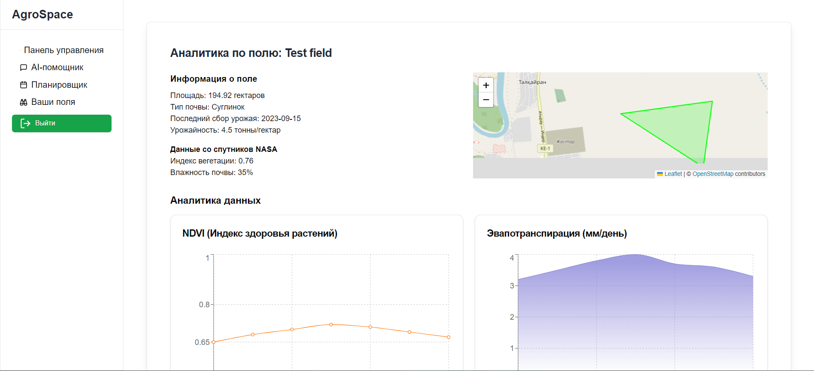

AgroSpace Dashboard

AgroSpace is a comprehensive web application designed to assist farmers and agricultural professionals in managing their farms more efficiently. Leveraging modern technologies such as Next.js, Supabase, and OpenAI's machine learning models, AgroSpace Dashboard provides real-time analytics, user-friendly chat interactions, and insightful data visualizations to optimize farming operations.

Features

    AI-Powered Chat: Interact with an intelligent assistant to receive recommendations, answer questions, and analyze uploaded images related to agricultural activities.
    Image Upload & Analysis: Upload images of crops to get real-time analysis and insights using OpenAI's machine learning models.
    User Profiles: Manage user information with additional profile fields stored in Supabase.
    Dashboard Analytics: Monitor key metrics such as soil moisture, temperature, precipitation, and crop health index.
    Real-Time Alerts & Community Insights: Stay updated with the latest alerts and insights from the farming community.
    Interactive Map: Visualize the location of your fields on an interactive map powered by Leaflet and OpenStreetMap.
    History Saving: All chat interactions and user data are securely stored in Supabase, ensuring data persistence and easy access.

Technologies Used

    Frontend:
        Next.js - React framework for server-rendered applications.
        React - JavaScript library for building user interfaces.
        TypeScript - Typed superset of JavaScript.
        Tailwind CSS - Utility-first CSS framework for styling.
        Recharts - Charting library for data visualization.
        React Leaflet - Maps integration using Leaflet.
        Lucide React - Icon library.
    Backend:
        Next.js API Routes - Serverless functions for backend logic.
        Supabase - Backend as a Service (BaaS) for database, authentication, and storage.
        OpenAI - AI models for natural language processing and image analysis.
        Formidable - Node.js module for parsing form data, especially file uploads.